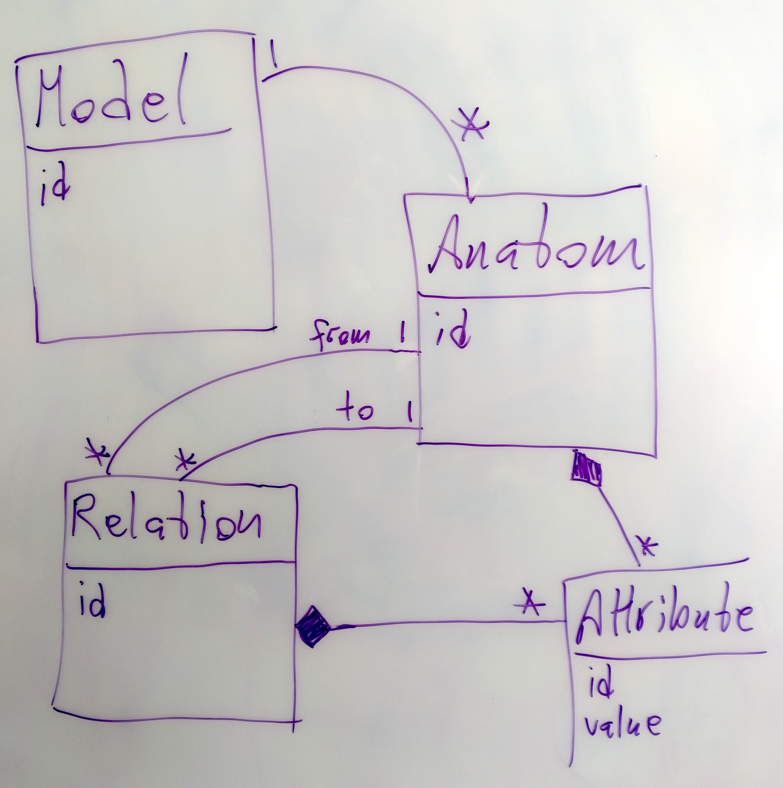

# anatomy_server
Fristående server för anatomi-web-applikation

## Bakgrund

FindOut har arbetat med s k anatomidiagram i många år. En anatomi beskriver ett systems beståndsdelar och deras inbördes relationer.

2014 skapade vi en desktop-applikation, Paipe, som är en fristående anatomieditor, som lagrar anatomi-filer i egna, lokala filer.

Nyligen skrev vi en efterförljare till Piape - Jira-anatomi. Den gjord som en plug-in till Jira (https://www.atlassian.com/software/jira), och den hämtar och lagrar alla data i Jira.

Men alla använder inte Jira, så vi behöver nu en enkel server som gör att man kan arbeta med anatomier utan att vara beroende av Jira.

Uppgiften är att skapa denna server i samarbete med oss som jobbar med anatomi-viewern. Vi har en prioriterad lista på olika funktioner som kan vara användbara för oss. Så ambitionsnivån kan anpassas till tidsramen i exjobbet.

Servern kan skrivas i Java enligt JavaEE-standarden.

## Sätta upp utvecklingsmiljö

Valfri IDE för Java

Maven v3.*

## Bygga och köra appen

git clone git@github.com:FindOut/anatomy_server.git

cd anatomy_server/

cd anatomy_server/

mvn spring-boot:run

### För att köra tester fristående:

#### Redigera application.properties

Öppna filen ../anatomy_server/src/main/resources/application.properties

och ändra service.type=db till service.type=memory

#### Maven-kommando från ../anatomy_server/

mvn integration-test

## Meta-modell

## Rest-gränssnitt

Alla URLer är av typen http://host/anatomy/api/..... 
Alla REST-anrop returnerar JSON om inte annat anges.

 namn | http-metod | URL | Body | Beskrivning 
 --- | --- | --- | --- | ---
lista modeller | GET | models | | returnerar en lista av alla modeller
en modell | GET | models/*id* | | returnerar modellen med angivet id, med alla dess anatomer, relationer och attribut
ta bort modell | DELETE | models/*id* | | tar bort modellen med angivet id från servern
skapa modell | POST | models | | skapar en ny tom modell med ett unikt id, som returneras
skapa anatom i en modell | POST | models/*id*/anatoms | | skapa en nya anatom i modell *id*, som returneras
hämta alla anatomer från en modell	| GET	|	models/*id*/anatoms | |	returnerar en lista med alla anatomer för modell med angivet id
hämta en anatom	|	GET	|	models/*modelId*/anatoms/*anatomId* | |	returnerar anatomen med angivet id, med alla dess relationer och attribut
ta bort anatom | DELETE | models/*modelId*/anatoms/*anatomId* | | tar bort anatomen med angivet id från servern
skapa relation |	POST |	relations	| {from : [integer], to : [integer]} |	skapar en relation från anatom *anatomId* till anatom *toAnatom*
hämta alla relationer från en anatom |	GET |	models/*modelId*/anatoms/*anatomId*/relations	| | returnerar en lista med alla relationer för anatom med angivet id
hämta alla utgående relationer från en anatom |	GET |	models/*modelId*/anatoms/*anatomId*/relations/outbound	| | returnerar en lista med alla utgående relationer för anatom med angivet id
hämta alla ingående relationer från en anatom |	GET |	models/*modelId*/anatoms/*anatomId*/relations/inbound	| | returnerar en lista med alla ingående relationer för anatom med angivet id
hämta en relation	|	GET |	relations/*relationId* | | returnerar relationen med angivet id
ta bort relation	|	DELETE |	relations/*relationId* | | tar bort relationen med angivet id från servern
sätt anatom-attribut |	POST |	models/*modelId*/anatoms/*anatomId*/attributes |	{value : [integer]}	| skapar attribut, sätter dess värde, och returnerar attributet
ändra anatom-attribut	|	PUT |	attributes/*attributeId* | {value : [integer]} |	ändrar värdet på attributet med angivet id
ta bort anatom-attribut	|	DELETE |	attributes/*attributeId* | |	tar bort attributet med angivet id från servern
sätt relations-attribut	|	POST |	relations/*relationId*/attributes |	{value : [integer]} |	skapar attribut, sätter dess värde, och returnerar attributet		
ta bort relations-attribut |	DELETE |	relations/*relationId*/attributes/*attributeId* | |	tar bort attributet med angivet id från servern

